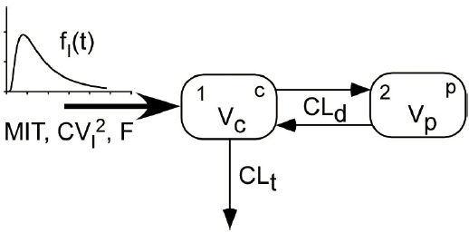
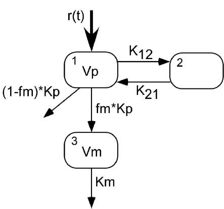

```{r setup, include = FALSE}
library(knitr)
```


### Introduction
'nlmixr' is an R package for fitting general dynamic models, pharmacokinetic (PK) models and pharmacokinetic-pharmacodynamic (PKPD) models in particular, with either individual data or population data. `nlmixr` has five main modules:  1) `dynmodel()` and its mcmc cousin `dynmodel.mcmc()` for nonlinear dynamic models of individual data; 2) `nlme_lin_cmpt()`for one to three linear compartment models of population data with first order absorption, or i.v. bolus, or i.v. infusion; 3) `nlme_ode()` for general dynamic models defined by ordinary differential equations (ODEs) of population data; 4) `saem_fit()` for general dynamic models defined by closed-form solutions or ordinary differential equations (ODEs) of population data by the Stochastic Approximation Expectation-Maximization (SAEM) algorithm;  5) `gnlmm()` for generalized non-linear mixed-models (optionally defined by ordinary differential equations) of population data by adaptive Gaussian quadrature algorithm. 

A few utilities to facilitate population model building are also included in `nlmixr`.

```{r}
library(nlmixr, quietly = TRUE)
source("print.summary.lme.R")	  #suppress data printout
```


### Non-population dynamic model 

The `dynmodel()` module fits general dynamic models, often expressed as a set of ODEs, of individual data with possible multiple endpoints.  This module has similar functionality as the `ID` module of `ADAPT 5`.

We use two examples from the ADAPT 5 User's Guide to illustrate the usage of non-population dynamic model with `dynmodel()`.

#### Inverse Gaussian Absorption Model

> This example illustrates the use of the inverse Gaussian (IG) function to model the oral absorption process of a delayed release compound. It is assumed that the plasma drug concentration following oral administration of the drug can be decomposed into an independent input process (representing dissolution, transit and absorption processes) followed by the disposition process. It is further assumed that the parameters of a linear two compartment model used to describe the disposition
process have been estimated following intravenous drug administration to an individual. The model shown in Figure 1 will then be used to describe the plasma kinetics of an oral formulation of the drug delivered to the individual.

  
**Figure 1. Two compartment disposition model with IG function input**  


This system of a two-compartment disposition model with IG absorption is defined in the following string:
```{r}
ode <- "
   dose=200;
   pi = 3.1415926535897931;

   if (t<=0) {
      fI = 0;
   } else {
      fI = F*dose*sqrt(MIT/(2.0*pi*CVI2*t^3))*exp(-(t-MIT)^2/(2.0*CVI2*MIT*t));
   }

   C2 = centr/V2;
   C3 = peri/V3;
   d/dt(centr) = fI - CL*C2 - Q*C2 + Q*C3;
   d/dt(peri)  =              Q*C2 - Q*C3;
"
sys1 <- RxODE(model = ode)

```

> In the model above the systemic drug input function, $f_i(t)$, is assumed to be a single inverse Gaussian function defined as:
$$ f_i(t) = D\cdot F\sqrt{\frac{MIT}{2\pi CV_t^2 t^3}} \exp\left[-\frac{(t-MIT)^2}{2CV_t^2 MIT t}\right]$$
where `MIT` represents the mean input time and $CV^2$ is a normalized variance ( is the standard deviation of the density function $f_i(t)/(D\cdot F)$ divided by `MIT`, i.e., the relative dispersion of input times). The factor `F` is the bioavailability of the orally administered dose .

In this example, disposition parameters are assumed known.  The three parameters related to the delayed absorption, `MIT`, `CVI2` and `F`, are to be estimated.

`dynmodel()` takes the following arguments: an RxODE object (compiled ODE solver), a list of formulae that relates system defined quantities and measurement(s) with either or both additive error `add()` and proportional error `prop()`, an event table object that defines the inputs and observation schedule, a named vector with initial values of system parameters, a `data.frame` contains the data, optional known system parameters (`fixPars`) not to be estimated, and other optional control parameters for optimization routines.
```{r}
dat <- read.table("invgaussian.txt", header=TRUE)
mod <- cp ~ C2 + prop(.1)
inits <- c(MIT=190, CVI2=.65, F=.92)
fixPars <- c(CL=.0793, V2=.64, Q=.292, V3=9.63)
ev <- eventTable()
ev$add.sampling(c(0, dat$time))
(fit <- dynmodel(sys1, mod, ev, inits, dat, fixPars))
```

More information about the model (convergence information and number of function evulation of the optimization process) is displayed by calling the `summary()` function.  Basic goodness-of-fit plots are generated by calling `plot()`.
```{r, fig.width=12, fig.height=4}
summary(fit)
par(mar=c(4,4,1,1), mfrow=c(1,3))
plot(fit, cex=2)

```


#### Parent/Metabolite (multiple endpoints)

> Figure 2 shows the model used to describe the kinetics of a parent compound and its metabolite used in this example. The model relating dose of the parent compound to the plasma concentrations of parent drug and its metabolite can be rewritten in terms of the ratio $Vm/fm$ along with the other model parameters $Kp, Vp, K_{12}, K_{21}$ and $fm$.



**Figure 2. Model for example pmetab. Kp is the total elimination rate of the parent compound, while fm represent the fraction metabolized.**  

Note the list that specifies the statistical measurement models for concentrations of both parent and its metabite.
```{r}
ode <- "
Cp = centr/Vp;
Cm = meta/Vm;
d/dt(centr) = -k12*centr + k21*peri -kp*centr;
d/dt(peri)  =  k12*centr - k21*peri;
d/dt(meta)  =                        kp*centr - km*meta;
"
sys2 <- RxODE(model = ode)

dat <- read.table("metabolite.txt", header=TRUE)
mod <- list(y1 ~ Cp+prop(.1), y2 ~ Cm+prop(.15))
inits <- c(kp=0.4, Vp=10., k12=0.2, k21=0.1, km=0.2, Vm=30.)
ev <- eventTable()
ev$add.dosing(100, rate=100)
ev$add.sampling(c(0, dat$time))
(fit <- dynmodel(sys2, mod, ev, inits, dat))
```

Alternative error models can be tested and compared without re-compilation of the system.  For instance, a combined error structure with both additive and proportional errors for the parent compound concentration is easily re-fitted with the following code:
```{r}
mod <- list(y1 ~ Cp+add(.2)+prop(.1), y2 ~ Cm+prop(.15))
(fit <- dynmodel(sys2, mod, ev, inits, dat))
```

Although the combined error produces a slightly higher likelihood, the previous proportional error model has smaller AIC and BIC, and is hence preferred.


#### Parent/Metabolite (continued - mcmc estimation)

The `dynmodel.mcmc()` has a similar functionality and user interface as `dynmodel()` for general dynamic models, except it uses Bayesian Markov Chain Monte-Carlo (mcmc) for estimation.  The underlying sampling algorithm is Neal's efficient slice sampling algorithm.

```{r}
mod <- list(y1 ~ Cp+prop(.1), y2 ~ Cm+prop(.15))
(fit <- dynmodel.mcmc(sys2, mod, ev, inits, dat))
```

`dynmodel.mcmc()` returns a matrix of raw mcmc samples.  This matrix can be further manipulated for further plots and inferences.  For instances, trace plots can be easily generated by the following:
```{r}
par(mfrow=c(4,2), mar=c(2,4,1,1))
s <- lapply(1:dim(fit)[2], function(k) 
     plot(fit[,k], type="l", col="red", ylab=dimnames(fit)[[2]][k]))
```


### Linear compartment models 
`nlme_lin_cmpt()` fits a linear compartment model with either first order absorption, or i.v. bolus, or i.v. infusion using the estimation algorithm implemented in the 'nlme' package.  A user specifies the number of compartments (up to three), route of drug administrations, and the model parameterization. `nlmixr` supports the clearance/volume parameterization and the micro constant parameterization, with the former as the default.  Specification of fixed effects, random effects and intial values follows the nlme notations.

We use an extended version of the Theophiline PK data [^1] accompanied with the NONMEM distribution (also an example in the nlme documentation) as an illustration of `nlme_lin_cmpt`.  We model the Theophiline PK by a one-compartment model with first order absorption and with default clearance/volume parameterization.  All model parameters are log-transformed; random effects are added to `KA` and `CL`.

[^1]: To demonstrate/test the capability of handling multiple doses by `nlme_lin_cmpt`, we simulated the Day 7 concentrations with a once daily (*q.d.*) regimen for 7 days, in addition to the Day 1 concentrations of the original Theophiline data.

```{r}
dat <- read.table(system.file("examples/theo_md.txt", package = "nlmixr"), head=TRUE)
specs <- list(fixed=lKA+lCL+lV~1, random = pdDiag(lKA+lCL~1), start=c(lKA=0.5, lCL=-3.2, lV=-1))
fit <- nlme_lin_cmpt(dat, par_model=specs, ncmt=1)
summary(fit)
plot(augPred(fit,level=0:1))
```

I.v. bolus can be specified by setting `oral=FALSE`,  i.v. infusion by `oral=FALSE` and `infusion=TRUE`.  To use micro-constant parameterization, one simply sets `parameterization=2`.  Covariate analyses can be performed with the nlme() notations.  In the following sample code, `WT` is a covariate to the log-transformed `CL` and `V`.
```{r}
specs <- list(
	fixed=list(lKA~1, lCL+lV~WT), 
	random = pdDiag(lKA+lCL~1), 
	start=c(0.5, -3.2, 0, -1, 0))
fit <- nlme_lin_cmpt(dat, par_model=specs, ncmt=1)
#plot(augPred(fit,level=0:1))
#fit
```

Additional arguments/options to nlme() can be passed along via calls to `nlme_lin_cmpt`.  For instance, if information on the iteration processs of optimization is of interest, one may pass `verbose=TRUE` to nlme() when calling `nlme_lin_cmpt`.
```
fit <- nlme_lin_cmpt(dat, par_model=specs, ncmt=1, verbose=TRUE)
```
Typically, nlme-defined models do not require starting values for inter-individual variance components. If you do want to specify these, the initial 'random' statement would need to be replaced with: 
```
random = pdDiag(value=diag(c(2,2)), form =lKA+lCL~1)
```
where the 'value' statement specifies the starting values for the diagonal random-effects matrix in this case. The values are the square of the CV of the IIV divided by the residual error SD: with an IIV of 30% and a residual error of 20%, starting values would be (0.3/0.2)^2=2.25.

### Parameterization in `nlme_lin_cmpt`
Depending on the model selection and parameterization selection, for internal calculations, `nlme_lin_cmpt` uses a particular set of parameterizations from the following list, the first three being the clearance/volume parameterizations for one-three compartments, and the last three the corresponding micro constant parameterizations.  `TLAG` is excluded when `tlag=FALSE`, `KA` and `TLAG` are excluded when `oral=FALSE`.
```
pm <- list(
    c("CL", "V", "KA", "TLAG"),
    c("CL", "V", "CLD", "VT", "KA", "TLAG"),
    c("CL", "V", "CLD", "VT", "CLD2", "VT2", "KA", "TLAG"),
    c("KE", "V", "KA", "TLAG"),
    c("KE", "V", "K12", "K21", "KA", "TLAG"),
    c("KE", "V", "K12", "K21", "K13", "K31", "KA", "TLAG")
)
dim(pm)<-c(3,2)
```    

Model parameters in the `par_model` argument and the parameters used for internal calculations are bridged by a function supplied to the `par_trans` argument.  A user can do any parameter transformation deemed necessary within such a function, however, symbols defined in the environment of the `par_trans` function (including the formal arguments and the derived variables) have to be a superset of parameters required by a particular model with the chosen route of administration, parameterization and `tlag` flag.  For instance, with `ncmt=1`, `oral=TRUE`, and `parameterization=1`, the environment of the `par_trans` function has to contain `CL`, `V` and `KA`; whereas with `ncmt=1`, `oral=TRUE`, `parameterization=2`, and `tlag=TRUE`, the environment of the `par_trans` function has to have `KE`, `V`, `KA`, and `TLAG`.

To facilitate models with the clearance/volume parameterization and the micro parameterization, `nlmixr` provides a set of predefined `par_trans` functions with log-transformed parameters of linear compartment models with different routes of administration and parameterizations.  Arguments `ncmt`, `oral`, `parameterization`, and `tlag` to function `nlme_lin_cmpt` uniquely determine a proper `par_trans` function via an internal utility.  Below is such a function for `ncmt=1`, `oral=TRUE`, `parameterization=1`, and `tlag=TRUE`.
```
par.1cmt.CL.oral.tlag <- function(lCL, lV, lKA, lTLAG)
{
  CL <- exp(lCL)
  V <- exp(lV)
  KA <- exp(lKA)
  TLAG <- exp(lTLAG)
}
```
With this model, a user needs to specify the fixed-effects, random-effects and initial values of the fixed effects for parameters `lCL`, `lV`, `lKA`, and `lTLAG`.

If a user perfers to parameterize a linear compartment model other than the supported parameterizations, he/she needs to write a cutomized parameterization function and supply the `par_trans` argument when calling `nlme_lin_cmpt`.  Note that in the following example, the customized `par_trans` function defines `KE`, `V`, and `KA` -- parameters needed for `ncmt=1`, `parameterization=2` with the default options `oral=TRUE` and `tlag=FALSE`. 

```{r}
mypar <- function(lKA, lKE, lCL)
{
    KA <- exp(lKA) 
    KE <- exp(lKE) 
    CL <- exp(lCL)
    V  <- CL/KE
}
specs <- list(
	fixed=lKA+lCL+lKE~1, 
	random = pdDiag(lKA+lCL~1), 
	start=c(0.5, -2.5, -3.2)
)
fit <- nlme_lin_cmpt(
	dat, par_model=specs, 
	ncmt=1, parameterization=2, par_trans=mypar)
#plot(augPred(fit,level=0:1))
fit
```


### Models defined by ordinary differential equations
`nlme_ode()` fits a general population PKPD model defined by a set of ODEs.  The user-defined dynamic system is defined in a string and provided to the `model` argument.  The syntax of this mini-modeling language is detailed in the appendix. In addition to the `par_model` and `par_trans` arguments as before, a user specifies the response variable. A response variable can be any of the state variables or the derived variables in the system definition.  Occasionally, the response variable may need to be scaled to match the observations.  In the following example, we model the afore-mentioned Theophiline PK example by a set of ODEs.  In this system, the two state variables `depot` and `centr` denote the drug amount in the absorption site and the central circulation, respetively.  Observations are the measured drug concentrations in the central circulation (not the drug amount) at times.  Hence, the response variable is the volume-scaled drug amount in the central circulation.
```{r}
ode <- "
d/dt(depot) =-KA*depot;
d/dt(centr) = KA*depot - KE*centr;
"
dat <- read.table("theo_md.txt", head=TRUE)
dat$WG <- dat$WT>70
mypar <- function(lKA, lKE, lCL)
{
    KA <- exp(lKA) 
    KE <- exp(lKE) 
    CL <- exp(lCL)
    V  <- CL/KE
}
specs <- list(fixed=lKA+lKE+lCL~1, random = pdDiag(lKA+lCL~1), start=c(lKA=0.5, lKE=-2.5, lCL=-3.2))
fit <- nlme_ode(dat, model=ode, par_model=specs, par_trans=mypar, response="centr", response.scaler="V")
nlme_gof(fit)
fit
```


### Population modeling utilities
#### Visual Predictive Checks (VPC)

VPC plots can be produced by calling `vpc()`:
```{r, fig.width=12, fig.height=6}
vpc(fit, 100)
```

Conditional VPCs can be easily generated:
```{r, fig.width=12, fig.height=6}
par(mfrow=c(1,2))
vpc(fit, 100, condition="WG")
```

#### Bootstrap

```{r}
dat <- read.table("theo_md.txt", head=TRUE)
specs <- list(fixed=lKA+lCL+lV~1, random = pdDiag(lKA+lCL~1), start=c(lKA=0.5, lCL=-3.2, lV=-1))
set.seed(99); nboot = 20;

cat("generating", nboot, "bootstrap samples...\n")
cmat <- matrix(NA, nboot, 3)
for (i in 1:nboot)
{
	#print(i)
	bd <- bootdata(dat)
	fit <- nlme_lin_cmpt(bd, par_model=specs, ncmt=1)
	cmat[i,] = fit$coefficients$fixed
}
dimnames(cmat)[[2]] <- names(fit$coefficients$fixed)
print(head(cmat))

require(lattice)
df <- do.call("make.groups", split(cmat, col(cmat)))
df$grp <- dimnames(cmat)[[2]][df$which]
print(bwplot(grp~exp(data), df))
```

#### Covariate selection

```{r}
dat <- read.table("theo_md.txt", head=TRUE)
dat$LOGWT <- log(dat$WT)
dat$TG <- (dat$ID < 6) + 0    #dummy covariate

specs <- list(
	fixed=list(lKA=lKA~1, lCL=lCL~1, lV=lV~1), 
	random = pdDiag(lKA+lCL~1), 
	start=c(0.5, -3.2, -1))
fit0 <- nlme_lin_cmpt(dat, par_model=specs, ncmt=1)
cv <- list(lCL=c("WT", "TG", "LOGWT"), lV=c("WT", "TG", "LOGWT"))
fit <- frwd_selection(fit0, cv, dat)
print(summary(fit))
```


### Stochastic Approximation Expectation-Maximization (SAEM)

`saem_fit()` fits a nonlinear mixed-effect model by the SAEM algorithm. `saem_fit()` is a compiled function that changes when the structure model changes.  Before running this function, a user needs to generate a configuration list by calling the function `configsaem()`.  Standard inputs to this function are: 1) a compiled saem model 2) a data.frame; 3) a list of covariates (`covar`) and residual model with additive (`res.mod=1`), proportional  (`res.mod=2`) and combination of additive and proportional  (`res.mod=3`); 4) initial values for the fixed effect and residual error.

```{r}
#ode <- "d/dt(depot) =-KA*depot; 
#        d/dt(centr) = KA*depot - KE*centr;"
#m1 = RxODE(ode, modName="m1")
#ode <- "C2 = centr/V; 
#        d/dt(depot) =-KA*depot; 
#        d/dt(centr) = KA*depot - KE*centr;"
#m2 = RxODE(ode, modName="m2")

PKpars = function()
{
  CL = exp(lCL)
  V = exp(lV)
  KA = exp(lKA)
  KE = CL / V
  xxx = 0;
  #initCondition = c(0,xxx)
}
PRED = function() centr / V
PRED2 = function() C2

saem_fit <- gen_saem_user_fn(model=lincmt(ncmt=1, oral=T))
#saem_fit <- gen_saem_user_fn(model=m1, PKpars, pred=PRED)
#saem_fit <- gen_saem_user_fn(model=m2, PKpars, pred=PRED2)


#--- saem cfg
nmdat = read.table("theo_sd.dat",  head=T)
model = list(saem_mod=saem_fit, covars="WT")
inits = list(theta=c(.05, .5, 2))
cfg   = configsaem(model, nmdat, inits)
cfg$print = 50

#cfg$Rfn = nlmixr:::Ruser_function_cmt
#dyn.load("m1.d/m1.so");cfg$Rfn = nlmixr:::Ruser_function_ode
fit = saem_fit(cfg)
fit
df = plot(fit)
``` 


### Generalized non-linear mixed-models (gnlmm)

Generalized non-linear mixed-models (gnlmm) find many useful applications in different fields, pharmacokinetics and pharmacodynamics
in particular.

`gnlmm()` calculates the marginal likehood by adaptive Gaussian quadrature.  For a description of this method, please find an excellent discussion in the documentation of SAS `PROC NLMIXED`.

At minimum, `gnlmm()` takes three arguments: the user-defined log-likehood function, the data frame and initial values. Initial values take the form of a named list: `THTA` for fixed effects, `OMGA` for random effect.  The latter is a list of formulae; the lhs of a formula specifies the block of correlated random effects (ETAs), the rhs of the formula gives the initial values of the lower half of the variance matrix.


Read in demo data:
```{r}
load("/home/wangwez/nlmixr/vignettes/.RData")
```


#### Count data

This example uses the pump failure data of Gaver and O’Muircheartaigh (1987). The number of failures 
and the time of operation are recorded for 10 pumps. Each of the pumps is classified into one of 
two groups corresponding to either continuous or intermittent operation.

```{r}
llik <- function()
{
	if (group==1) lp = THETA[1]+THETA[2]*logtstd+ETA[1]
	else          lp = THETA[3]+THETA[4]*logtstd+ETA[1]
	lam = exp(lp)
	dpois(y, lam, log=TRUE)
}
inits = list(THTA=c(1,1,1,1), OMGA=list(ETA[1]~1))

fit = gnlmm(llik, pump, inits, 
	control=list(
	    reltol.outer=1e-4,
		optim.outer="nmsimplex",
		nAQD=5
	)
)
```

Covariance matrix of fixed-effect parameters can be calculated with `calcCov()` after a fit.
```{r}
cv = calcCov(fit)
cbind(fit$par[fit$nsplt==1], sqrt(diag(cv)))
```

`gnlmm()` fit matches well of `PROC NLMIXED`.


#### Binary data

For this example, consider the data from Weil (1970), also studied by Williams (1975), Ochi and Prentice (1984), 
and McCulloch (1994). In this experiment 16 pregnant rats receive a control diet and 16 receive a chemically 
treated diet, and the litter size for each rat is recorded after 4 and 21 days.

```{r}
llik <- function()
{
	lp = THETA[1]*x1+THETA[2]*x2+(x1+x2*THETA[3])*ETA[1]
	p = pnorm(lp)
	dbinom(x, m, p, log=TRUE)
}
inits = list(THTA=c(1,1,1), OMGA=list(ETA[1]~1))

gnlmm(llik, rats, inits, control=list(nAQD=7))
```

The `gnlmm()` fit closely matches the fit of `PROC NLMIXED`.


#### `gnlmm` with ODEs


```{r}
ode <- "
d/dt(depot) =-KA*depot;
d/dt(centr) = KA*depot - KE*centr;
"
sys1 = RxODE(ode)

pars <- function()
{
	CL = exp(THETA[1] + ETA[1])#; if (CL>100) CL=100
	KA = exp(THETA[2] + ETA[2])#; if (KA>20) KA=20
	KE = exp(THETA[3])
	V  = CL/KE
	sig2 = exp(THETA[4])
}
llik <- function() {
	pred = centr/V
	dnorm(DV, pred, sd=sqrt(sig2), log=TRUE)
}
inits = list(THTA=c(-3.22, 0.47, -2.45, 0))
inits$OMGA=list(ETA[1]~.027, ETA[2]~.37)
#inits$OMGA=list(ETA[1]+ETA[2]~c(.027, .01, .37))
theo <- read.table("theo_md.txt", head=TRUE)

fit = gnlmm(llik, theo, inits, pars, sys1, 
	control=list(trace=TRUE, nAQD=5))

cv = calcCov(fit)
cbind(fit$par[fit$nsplt==1], sqrt(diag(cv)))
```

After convergence, `prediction()` can be used to calculate the prediction.
```{r}
pred = function() {
	pred = centr/V
}

s = prediction(fit, pred)
plot(s$p, s$dv); abline(0,1,col="red")
```


### References 

- Lindstrom, M.J. and Bates, D.M. (1990) "Nonlinear Mixed Effects Models for Repeated Measures Data", Biometrics, 46, 673-687.
- Pinheiro, J.C. and Bates, D.M. (1996) "Unconstrained Parametrizations for Variance-Covariance Matrices", Statistics and Computing, 6, 289-296.
- Pinheiro, J.C., and Bates, D.M. (2000) "Mixed-Effects Models in S and S-PLUS", Springer.
- Sheiner and Beal (19??) "NONMEM users guide".
- Wang, W, Hallow, KM, and James, DA (2015) "A tutorial on RxODE: simulating differential equation pharmacometrics models in R", CPT: Pharmacometrics & Systems Pharmacology, to appear.
- D'Argenio DZ, Schumitzky A, and Wang X (2009). "ADAPT 5 User's Guide: Pharmacokinetic/Pharmacodynamic Systems Analysis Software".
- Neal, RM (2003) "Slice sampling" (with discussion), Annals of Statistics, vol. 31, no. 3, pp. 705-767.
- Karlsson, M. O. and Savic, R. M. (2007), Diagnosing Model Diagnostics. Clinical Pharmacology & Therapeutics, 82: 17-20.
- Gaver, D. P. and O’Muircheartaigh, I. G. (1987), "Robust Empirical Bayes Analysis of Event Rates," Technometrics, 29, 1–15.
- McCulloch, C. E. (1994), "Maximum Likelihood Variance Components Estimation for Binary Data," Journal of the American Statistical Association, 89, 330–335.
- Ochi, Y. and Prentice, R. L. (1984), "Likelihood Inference in a Correlated Probit Regression Model," Biometrika, 71, 531–543.
- Weil, C. S. (1970), "Selection of the Valid Number of Sampling Units and Consideration of Their Combination in Toxicological Studies Involving Reproduction, Teratogenesis, or Carcinogenesis," Food and Cosmetic Toxicology, 8, 177–182.
- Williams, D. A. (1975), "The Analysis of Binary Responses from Toxicological Experiments Involving Reproduction and Teratogenicity," Biometrics, 31, 949–952.
- Kuhn, E., and Lavielle, M. Coupling a stochastic approximation version of EM with a MCMC procedure. ESAIM P&S 8 (2004), 115–131.
- Kuhn, E., and Lavielle, M. Maximum likelihood estimation in nonlinear mixed effects models. Computational Statistics and Data Analysis 49 (2005), 1020–1038.


### Appendix: Technical notes


#### RxODE Syntax
An `RxODE` model specification consists of one or more 
statements terminated by semi-colons, `;`, and
optional comments (comments are delimited by `#` and an 
end-of-line marker).  `NB:` Comments are not allowed 
inside statements.

A block of statements is a set of statements delimited by
curly braces, `{ ... }`.
Statements can be either assignments or conditional `if`
statements. Assignment statements can be either `simple`
assignments, where the left hand is an identifier (i.e., variable), or 
special `time-derivative` assignments, where the left hand
specifies the change of that variable with respect to time, e.g., `d/dt(depot)`.

Expressions in assignment and `if` statements can be 
numeric or logical (no character expressions are currently supported).
Numeric expressions can include the following numeric operators 
(`+`, `-`, `*`,
`/`, `^`),   and
those mathematical functions defined in the C or the
R math libraries (e.g., `fabs`, `exp`, `log`, `sin`).
(Note that the modulo operator `%` is currently
not supported.)

Identifiers in an `RxODE` model specification can refer to:

- state variables in the dynamic system (e.g., compartments in a
pharmacokinetics/pharamcodynamics model);
- implied input variable, `t` (time), 
`podo` (oral dose, for absorption models), and
`tlast` (last time point);
- model parameters, (`ka` rate of absorption, `CL` 
clearance, etc.);
- others, as created by assignments as part of the model
specification.

Identifiers consists of case-sensitive alphanumeric characters, 
plus the underscore `_` character.  `NB:` the
dot `.` character is `not` a valid character
identifier.

The values of these variables at pre-specified time points are
saved as part of the fitted/integrated/solved model (see
`eventTable`, in particular its member function 
`add.sampling` that defines a set of time points at which
to capture a snapshot of the syste via the values of these variables).

The ODE specification mini-language is parsed with the help of
the open source tool `DParser`, Plevyak (2015).


#### Dosing events 

A unique feature of general PKPD modeling is the ubiquity of dosing events.  When a PKPD model is defined by ODEs, the ODE solver needs to recognize these discrete events and re-start the integration process if necessary.  Sheiner and Beal implemented the concept of using an integer variable `EVID` to inform the ODE solver of the nature of the current event.  In addition to `EVID`, NONMEM includes several other auxiliary variables to completely and uniquely define a general dosing event: CMT, AMT, RATE, ADDL, II.

RxODE borrows the core ideas from the NONMEM implementation but uses a more compact yet somewhat convoluted format to represent the discrete dosing events.  

- `EVID=0` denotes an observation event
- `EVID>0` denotes an dosing event.  In general, an `EVID` in nlmixr has five digits: 
    a. The right-most two digits are reserved for defining different events; 
    b. The next two digits point to which state variable (or compartment) this event is applied to; 
    c. The fifth digit from the right takes a value 1 if the dosing is an infusion and 0 if the dosing is a bolus.
- `AMT` is the drug amount with a bolus dosing.  In case of an infusion, a positive number denotes the start of an infusion at a particular time with such an infusion rate; a negative number denotes the end of a previously started infusion. 


#### `nlmixr` & NONMEM comparison

NONMEM functionality not supported by `nlmixr`:

- mixture model
- steady-state (SS) dosing

`nlmixr` functionality not supported by NONMEM:

- General nested random effects
- ARMA residual model
- anova() for model selection
- integrated GoF & VPC functionality
- integrated simulation with uncertainty


#### Calculating covariance matrix of fixed-effect parameter estimates

```{r}
llik <- function()
{
	if (group==1) lp = THETA[1]+THETA[2]*logtstd+ETA[1]
	else          lp = THETA[3]+THETA[4]*logtstd+ETA[1]
	lam = exp(lp)
	dpois(y, lam, log=TRUE)
}
inits = list(THTA=c(1,1,1,1), OMGA=list(ETA[1]~1))

fit = gnlmm(llik, pump, inits, 
	control=list(
	    reltol.outer=1e-4,
		optim.outer="nmsimplex",
		nAQD=5
	)
)
```

```{r}
cv = calcCov(fit)
Rinv = attr(cv,"RinvS")$Rinv
S    = attr(cv,"RinvS")$S
Rinv*2					#inverse hessian matrix
solve(S)*4			    #inverse of score function product sum	
Rinv %*% S %*% Rinv		#sandwich estimate
```
