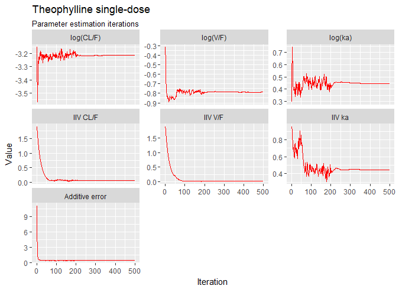
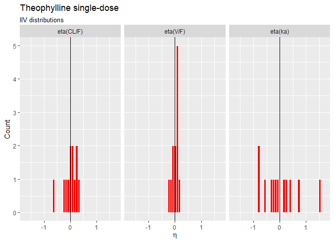
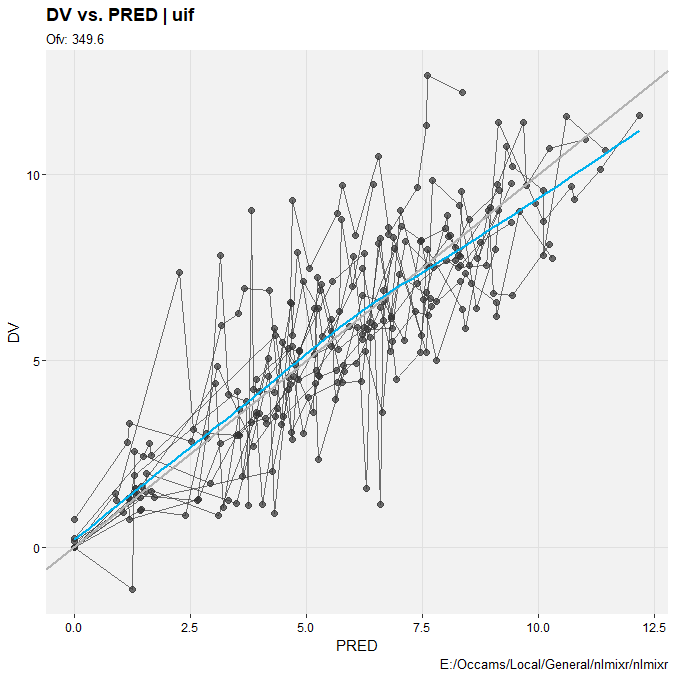
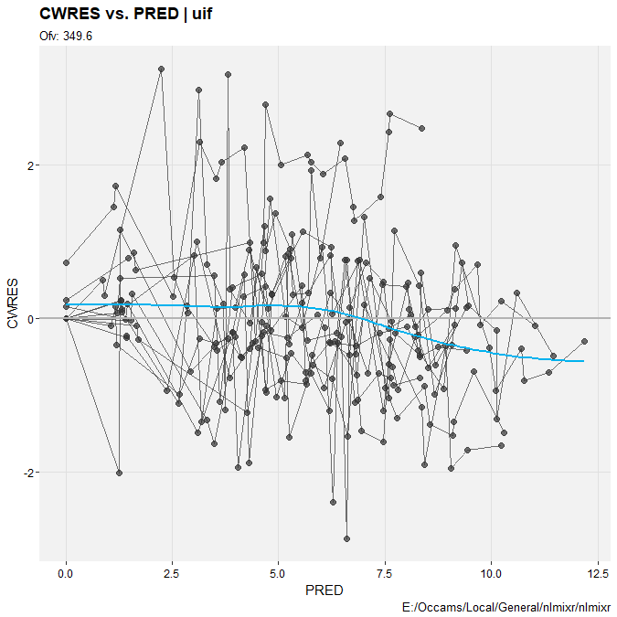
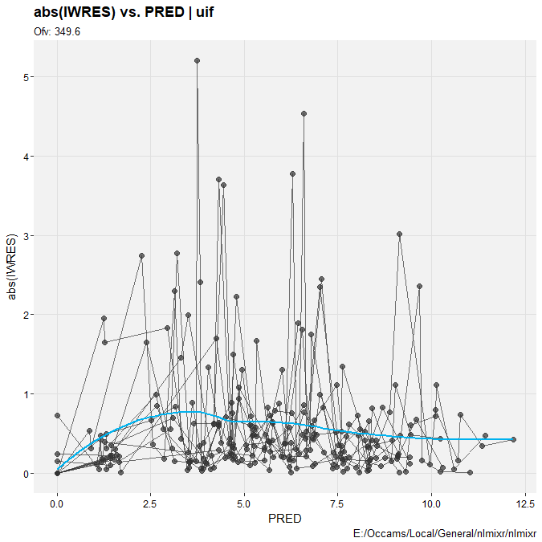

# Running PK models with nlmixr

nlmixr uses a unified interface for specifying and running
models. Let's start with a very simple PK example, using the
single-dose theophylline dataset generously provided by Dr. Robert
A. Upton of the University of California, San Francisco:

```{r}
## Load libraries
library(ggplot2)
library(nlmixr)

str(theo_sd)

ggplot(theo_sd, aes(TIME, DV)) + geom_line(aes(group=ID), col="red") + scale_x_continuous("Time (h)") + scale_y_continuous("Concentration") + labs(title="Theophylline single-dose", subtitle="Concentration vs. time by individual")

```

We can try fitting a simple one-compartment PK model to this small dataset. We write the model as follows:

```{r}
one.cmt <- function() {
    ini({
        tka <- .5   # log Ka
        tcl <- -3.2 # log Cl
        tv <- -1    # log V
        eta.ka ~ 1
        eta.cl ~ 2
        eta.v ~ 1
        add.err <- 0.1
    })
    model({
        ka <- exp(tka + eta.ka)
        cl <- exp(tcl + eta.cl)
        v <- exp(tv + eta.v)
        linCmt() ~ add(add.err)
    })
}
```

We can now run the model...

```{r}
fit <- nlmixr(one.cmt, theo_sd, est="nlme", calc.resid=FALSE)
print(fit)
```

We can alternatively express the same model by ordinary differential equations (ODEs):

```{r}
one.compartment.saem <- function() {
    ini({
        tka <- .5   # Log Ka
        tcl <- -3.2 # Log Cl
        tv <- -1    # Log V
        eta.ka ~ 1
        eta.cl ~ 2
        eta.v ~ 1
        add.err <- 0.1
    })
    model({
        ka <- exp(tka + eta.ka)
        cl <- exp(tcl + eta.cl)
        v <- exp(tv + eta.v)
        d/dt(depot) = -ka * depot
        d/dt(center) = ka * depot - cl / v * center
        cp = center / v 
        cp ~ add(add.err)
    })
}
```

We can try the Stochastic Approximation EM (SAEM) method to this model:

```r
fit <- nlmixr(one.compartment.saem, theo_sd, est="saem")
```

```c
Compiling RxODE differential equations...c:/Rtools/mingw_64/bin/gcc  -I"C:/PROGRA~1/R/R-34~1.2/include" -DNDEBUG     -I"d:/Compiler/gcc-4.9.3/local330/include"     -O2 -Wall  -std=gnu99 -mtune=core2 -c rx_3b3c0f7e21991fad1e55c3077c46e24a_x64.c -o rx_3b3c0f7e21991fad1e55c3077c46e24a_x64.o
c:/Rtools/mingw_64/bin/gcc -shared -s -static-libgcc -o rx_3b3c0f7e21991fad1e55c3077c46e24a_x64.dll tmp.def rx_3b3c0f7e21991fad1e55c3077c46e24a_x64.o -LC:/PROGRA~1/R/R-34~1.2/bin/x64 -lRblas -LC:/PROGRA~1/R/R-34~1.2/bin/x64 -lRlapack -lgfortran -lm -lquadmath -Ld:/Compiler/gcc-4.9.3/local330/lib/x64 -Ld:/Compiler/gcc-4.9.3/local330/lib -LC:/PROGRA~1/R/R-34~1.2/bin/x64 -lR
done.
C:/Rtools/mingw_64/bin/g++  -I"C:/PROGRA~1/R/R-34~1.2/include" -DNDEBUG     -I"d:/Compiler/gcc-4.9.3/local330/include"  -IC:/Users/nlmixr/DOCUME~1/R/WIN-LI~1/3.4/nlmixr/include -IC:/Users/nlmixr/DOCUME~1/R/WIN-LI~1/3.4/STANHE~1/include -IC:/Users/nlmixr/DOCUME~1/R/WIN-LI~1/3.4/Rcpp/include -IC:/Users/nlmixr/DOCUME~1/R/WIN-LI~1/3.4/RCPPAR~1/include -IC:/Users/nlmixr/DOCUME~1/R/WIN-LI~1/3.4/RCPPEI~1/include -IC:/Users/nlmixr/DOCUME~1/R/WIN-LI~1/3.4/BH/include   -O3 -mtune=native -march=native -Wno-unused-variable -Wno-unused-function -c saem71e81ac5342dx64.cpp -o saem71e81ac5342dx64.o
In file included from C:/Users/nlmixr/DOCUME~1/R/WIN-LI~1/3.4/RCPPAR~1/include/armadillo:52:0,
                 from C:/Users/nlmixr/DOCUME~1/R/WIN-LI~1/3.4/RCPPAR~1/include/RcppArmadilloForward.h:46,
                 from C:/Users/nlmixr/DOCUME~1/R/WIN-LI~1/3.4/RCPPAR~1/include/RcppArmadillo.h:31,
                 from saem71e81ac5342dx64.cpp:1:
C:/Users/nlmixr/DOCUME~1/R/WIN-LI~1/3.4/RCPPAR~1/include/armadillo_bits/compiler_setup.hpp:474:96: note: #pragma message: WARNING: use of OpenMP disabled; this compiler doesn't support OpenMP 3.0+
   #pragma message ("WARNING: use of OpenMP disabled; this compiler doesn't support OpenMP 3.0+")
C:/Rtools/mingw_64/bin/g++ -shared -s -static-libgcc -o saem71e81ac5342dx64.dll tmp.def saem71e81ac5342dx64.o C:/Working/nlmixr/rx_3b3c0f7e21991fad1e55c3077c46e24a_x64.dll -LC:/PROGRA~1/R/R-34~1.2/bin/x64 -lRblas -LC:/PROGRA~1/R/R-34~1.2/bin/x64 -lRlapack -lgfortran -lm -lquadmath -Ld:/Compiler/gcc-4.9.3/local330/lib/x64 -Ld:/Compiler/gcc-4.9.3/local330/lib -LC:/PROGRA~1/R/R-34~1.2/bin/x64 -lR
done.
1:     0.2936   -3.1515   -0.3166    0.9500    1.9000    1.9000   11.1432
2:    0.4815  -3.3577  -0.4751   0.9577   1.8050   1.8050   5.7848
3:    0.7435  -3.4761  -0.6772   0.9098   1.7147   1.7147   2.4877
4:    0.6739  -3.5700  -0.6901   0.8643   1.6290   1.6290   1.7050
5:    0.6951  -3.4874  -0.7071   0.8211   1.5476   1.5476   1.4010
6:    0.5690  -3.3963  -0.7542   0.7800   1.4702   1.4702   0.9980
7:    0.5346  -3.3423  -0.7814   0.7423   1.3967   1.3967   0.8210
8:    0.4469  -3.2585  -0.8184   0.7052   1.3268   1.3268   0.7238
9:    0.3935  -3.2638  -0.8330   0.6699   1.2605   1.2605   0.6806
10:    0.4153  -3.2282  -0.8281   0.7129   1.1975   1.1975   0.6297      
...
491:    0.4472  -3.2115  -0.7879   0.4430   0.0712   0.0176   0.4754
492:    0.4472  -3.2115  -0.7879   0.4429   0.0712   0.0176   0.4755
493:    0.4472  -3.2115  -0.7879   0.4427   0.0712   0.0176   0.4755
494:    0.4473  -3.2115  -0.7878   0.4424   0.0712   0.0176   0.4754
495:    0.4474  -3.2115  -0.7878   0.4424   0.0712   0.0176   0.4753
496:    0.4476  -3.2115  -0.7878   0.4423   0.0712   0.0176   0.4753
497:    0.4476  -3.2116  -0.7878   0.4424   0.0712   0.0177   0.4753
498:    0.4476  -3.2116  -0.7879   0.4423   0.0712   0.0176   0.4753
499:    0.4475  -3.2115  -0.7879   0.4424   0.0712   0.0176   0.4753
500:    0.4475  -3.2116  -0.7879   0.4426   0.0713   0.0176   0.4753
```
```r
## Calculate ETA-based prediction and error derivatives:
## Calculate d(f)/d(eta) 
## ...
## done
## ...
## done
```
```c
c:/Rtools/mingw_64/bin/gcc  -I"C:/PROGRA~1/R/R-34~1.2/include" -DNDEBUG     -I"d:/Compiler/gcc-4.9.3/local330/include"     -O2 -Wall  -std=gnu99 -mtune=core2 -c rx_12307179f04e4af4f5a8f71b6545a28d_x64.c -o rx_12307179f04e4af4f5a8f71b6545a28d_x64.o
c:/Rtools/mingw_64/bin/gcc -shared -s -static-libgcc -o rx_12307179f04e4af4f5a8f71b6545a28d_x64.dll tmp.def rx_12307179f04e4af4f5a8f71b6545a28d_x64.o -LC:/PROGRA~1/R/R-34~1.2/bin/x64 -lRblas -LC:/PROGRA~1/R/R-34~1.2/bin/x64 -lRlapack -lgfortran -lm -lquadmath -Ld:/Compiler/gcc-4.9.3/local330/lib/x64 -Ld:/Compiler/gcc-4.9.3/local330/lib -LC:/PROGRA~1/R/R-34~1.2/bin/x64 -lR
c:/Rtools/mingw_64/bin/gcc  -I"C:/PROGRA~1/R/R-34~1.2/include" -DNDEBUG     -I"d:/Compiler/gcc-4.9.3/local330/include"     -O2 -Wall  -std=gnu99 -mtune=core2 -c rx_9bb7d7958abef0092fc2389e956d74b4_x64.c -o rx_9bb7d7958abef0092fc2389e956d74b4_x64.o
c:/Rtools/mingw_64/bin/gcc -shared -s -static-libgcc -o rx_9bb7d7958abef0092fc2389e956d74b4_x64.dll tmp.def rx_9bb7d7958abef0092fc2389e956d74b4_x64.o -LC:/PROGRA~1/R/R-34~1.2/bin/x64 -lRblas -LC:/PROGRA~1/R/R-34~1.2/bin/x64 -lRlapack -lgfortran -lm -lquadmath -Ld:/Compiler/gcc-4.9.3/local330/lib/x64 -Ld:/Compiler/gcc-4.9.3/local330/lib -LC:/PROGRA~1/R/R-34~1.2/bin/x64 -lR
```
```r
The model-based sensitivities have been calculated.
It will be cached for future runs.
Calculating Table Variables...
done
```

This Windows example delivers a complete model fit as the `fit`
object, including parameter history, a set of fixed effect estimates,
and random effects for all included subjects.

Also note that the `nlme` fit returned the traditional `nlme`
object. You can instruct `nlmixr` to convert the `nlme` object to a
`nlmixr` object and calculate quantities like `CWRES` by specifying
`calc.resid=TRUE` or dropping this option entirely since it is turned
on by default.

Now back to the `saem` fit; Let's look at the fit using nlmixr's built-in diagnostics...

```r
plot(fit)
```


```r
fit
```

```r
> fit
-- nlmixr SAEM fit (ODE); OBJF calculated from FOCEi approximation -------------
                                                         OBJF      AIC      BIC Log-likelihood Condition Number
116.1543 130.1543 150.3339      -58.07713         140.8018

-- Time (sec; fit$time): -------------------------------------------------------
    saem setup Likelihood Calculation covariance table
elapsed 58.64 31.91                   0.31          0  0.44

-- Parameters (fit$par.fixed): -------------------------------------------------
    Parameter Estimate     SE %RSE Back-transformed(95%CI) BSV(CV%)
tka        Log Ka    0.455  0.198 43.4       1.58 (1.07, 2.32)    74.5%
tcl        Log Cl    -3.22 0.0814 2.53 0.0401 (0.0342, 0.0471)    27.2%
tv          Log V   -0.785 0.0426 5.43    0.456 (0.420, 0.496)    13.5%
add.err   add.err    0.691                            0.691            
Shrink(SD)%
tka        -0.520% 
tcl          3.76% 
tv           11.0% 
add.err      12.0% 

  No correlations in between subject variability (BSV) matrix
  Full BSV covariance (fit$omega) or correlation (fit$omega.R; diagonals=SDs)
  Distribution stats (mean/skewness/kurtosis/p-value) available in fit$shrink

-- Fit Data (object fit is a modified data.frame): -----------------------------
# A tibble: 132 x 21
  ID     TIME    DV  PRED     RES    WRES IPRED   IRES  IWRES CPRED  CRES
* <fct> <dbl> <dbl> <dbl>   <dbl>   <dbl> <dbl>  <dbl>  <dbl> <dbl> <dbl>
1 1     0      0.74  0    0.74    1.07     0     0.74   1.07   0    0.74 
2 1     0.25   2.84  2.84 0.00438 0.00254  3.86 -1.02  -1.48   2.68 0.164
3 1     0.570  6.57  5.07 1.50    0.656    6.79 -0.219 -0.316  4.84 1.73 
# ... with 129 more rows, and 10 more variables: CWRES <dbl>, eta.ka <dbl>,
#   eta.cl <dbl>, eta.v <dbl>, depot <dbl>, center <dbl>, ka <dbl>, cl <dbl>,
#   v <dbl>, cp <dbl>
```

```r
fit$eta
```
```r
   ID      eta.ka       eta.cl       eta.v
1   1  0.12895240 -0.629393083 -0.20786978
2   2  0.24202824  0.085230344 -0.01555575
3   3  0.39836641  0.005076775  0.04780371
4   4 -0.26316679 -0.076702383 -0.04668235
5   5 -0.07501618  0.076757369  0.06943232
6   6 -0.32677312  0.215018594  0.09234601
7   7 -0.83746008  0.236216832  0.08078046
8   8 -0.17361996  0.141848820  0.07864429
9   9  1.49070753 -0.181625209 -0.18270360
10 10 -0.79851904 -0.207206272 -0.03595335
11 11  0.75757178  0.338588793  0.19567123
12 12 -0.56750540  0.012073101 -0.09261596
```
Default trace plots can be generated using:
```r
traceplot(fit)
```

but with a little more work, we can get a nicer set of iteration trace
plots ("wriggly worms")...


```r

iter <- fit$par.hist.stacked
iter$Parameter[iter$par=="add.err"] <- "Additive error"
iter$Parameter[iter$par=="eta.cl"]  <- "IIV CL/F"
iter$Parameter[iter$par=="eta.v"]   <- "IIV V/F"
iter$Parameter[iter$par=="eta.ka"]  <- "IIV ka"
iter$Parameter[iter$par=="tcl"]     <- "log(CL/F)"
iter$Parameter[iter$par=="tv"]      <- "log(V/F)"
iter$Parameter[iter$par=="tka"]     <- "log(ka)"
iter$Parameter <- ordered(iter$Parameter, c("log(CL/F)", "log(V/F)", "log(ka)",
                                            "IIV CL/F", "IIV V/F", "IIV ka",
                                            "Additive error"))

ggplot(iter, aes(iter, val)) +
  geom_line(col="red") + 
  scale_x_continuous("Iteration") +
  scale_y_continuous("Value") +
  facet_wrap(~ Parameter, scales="free_y") +
  labs(title="Theophylline single-dose", subtitle="Parameter estimation iterations")

```


... and some random-effects histograms...

```r

etas <- data.frame(eta = c(fit$eta$eta.ka, fit$eta$eta.cl, fit$eta$eta.v),
                   lab = rep(c("eta(ka)", "eta(CL/F)", "eta(V/F)"), each=nrow(fit$eta)))
etas$lab <- ordered(etas$lab, c("eta(CL/F)","eta(V/F)","eta(ka)"))

ggplot(etas, aes(eta)) +
  geom_histogram(fill="red", col="white") + 
  geom_vline(xintercept=0) +
  scale_x_continuous(expression(paste(eta))) +
  scale_y_continuous("Count") +
  facet_grid(~ lab) +
  coord_cartesian(xlim=c(-1.75,1.75)) +
  labs(title="Theophylline single-dose", subtitle="IIV distributions")

```



## xpose

This is all very nice. But what we really want is a complete suite of model diagnostic
tools, like those available in [xpose](https://github.com/UUPharmacometrics/xpose), right?

First, save the nlmixr `fit` object you created (this example assumes in the same folder you're working in...)

```r
save(fit, file="nlmixrFit.RData")
```

Restart R, and install xpose from CRAN, if you haven't already...

```r
install.packages("xpose")
```

Now install the extension for nlmixr:

```r
devtools::install_github("nlmixrdevelopment/xpose.nlmixr")
```
Now restore your session...

```r
library(nlmixr)
library(xpose)
library(xpose.nlmixr)

load("nlmixrFit.RData")
```

... and convert your nlmixr fit object into an xpose fit object.

```r
xp <- xpose_data_nlmixr(fit)
```

Now let's look at some diagnostic plots!

```r
dv_vs_pred(xp)
```


```r
dv_vs_ipred(xp)
```


```r
pred_vs_pred(xp)
```


```r
absval_res_vs_pred(xp, res="IWRES")
```


We can also replicate some of nlmixr's internal plots...

```r
ind_plots(xp, res="IWRES")
```


For more information about using xpose, see the Uppsala pharmacometrics group's 
comprehensive site [here](https://uupharmacometrics.github.io/xpose/).

# The UI

The nlmixr modeling dialect, inspired by R and NONMEM, can be used to
fit models using all current and future estimation alogorithms within
nlmixr. Using these widely-used tools as inspiration has the advantage
of delivering a model specification syntax taht is instantly familira
to the majority of analysts working in pharmacometrics and related
fields.


## Overall model structure

Model specifications for nlmixr are written using functions containing
`ini` and `model` blocks. These functions can be called anything, but
must contain these two components. Let's look at a very simple
one-compartment model with no covariates.

```r
f <- function() {
    ini({   # Initial conditions/variables
            # are specified here
    })
    model({ # The model is specified
            # here
    })
}
```

### The ini block

The `ini` block specifies initial conditions, including initial
estimates and boundaries for those algorithms which support them
(currently, the built-in `nlme` and `saem` methods do
not). Nomenclature is similar to that used in NONMEM, Monolix and
other similar packages. In the NONMEM world, the `ini` block is
analogous to `$THETA`, `$OMEGA` and `$SIGMA` blocks.

```r
f <- function(){ # Note that arguments to the function are currently
                 # ignored by nlmixr
    ini({
        # Initial conditions for population parameters (sometimes
        # called THETA parameters) are defined by either '<-' or '='
        lCl <- 1.6      # log Cl (L/hr)
        
        # Note that simple expressions that evaluate to a number are
        # OK for defining initial conditions (like in R)
        lVc = log(90)  # log V (L)
        
        ## Also, note that a comment on a parameter is captured as a parameter label
        lKa <- 1       # log Ka (1/hr)
        
        # Bounds may be specified by c(lower, est, upper), like NONMEM:
        # Residuals errors are assumed to be population parameters
        prop.err <- c(0, 0.2, 1)
        
        # IIV terms will be discussed in the next example
    })
    
    # The model block will be discussed later
    model({})
}

```
As shown in the above example: 

* Simple parameter values are specified using an R-compatible
  assignment
* Boundaries my be specified by `c(lower, est, upper)`.
* Like NONMEM, `c(lower,est)` is equivalent to `c(lower,est,Inf)`
* Also like NONMEM, `c(est)` does not specify a lower bound, and is
  equivalent to specifying the parameter without using R's `c()`
  function.

These parameters can be named using almost any R-compatible
name. Please note that:

* Residual error estimates should be coded as population estimates
  (i.e. using `=` or `<-`, not `~`).
* Variable names that start with `_` are not supported. Note that R
  does not allow variable starting with `_` to be assigned without
  quoting them.
* Naming variables that start with `rx_` or `nlmixr_` is not allowed,
  since RxODE and nlmixr use these prefixes internally for certain
  estimation routines and for calculating residuals.
* Variable names are case-sensitive, just like they are in R. `CL` is
  not the same as `Cl`.

In mixture models, multivariate normal individual deviations from the
normal population and parameters are estimated (in NONMEM these are
called "ETA" parameters). Additionally, the variance/covariance matrix
of these deviations are is also estimated (in NONMEM this is the
"OMEGA" matrix). These also take initial estimates. In nlmixr, these
are specified by the `~` operator. This that is typically used in
statistics R for "modeled by", and was chosen to distinguish these
estimates from the population and residual error parameters.

Continuing from the prior example, we can annotate the estimates for
the between-subject error distribution...

```r
f <- function(){
    ini({
        lCl <- 1.6      # log Cl (L/hr)
        lVc = log(90)   # log V (L)
        lKa <- 1        # log Ka (1/hr)
        prop.err <- c(0, 0.2, 1)
        
        # Initial estimate for ka IIV variance
        # Labels work for single parameters
        eta.ka ~ 0.1    ## BSV Ka

        # For correlated parameters, you specify the names of each
        # correlated parameter separated by a addition operator `+`
        # and the left handed side specifies the lower triangular
        # matrix initial of the covariance matrix.
        eta.cl + eta.vc ~ c(0.1,
                            0.005, 0.1)
                            
        # Note that labels do not currently work for correlated
        # parameters.  Also, do not put comments inside the lower
        # triangular matrix as this will currently break the model.
    })
    
    # The model block will be discussed later
    model({})
}
```
As shown in the above example: 

* Simple variances are specified by the variable name and the estimate
  separated by `~`.
*	Correlated parameters are specified by the sum of the variable
     labels and then the lower triangular matrix of the covariance is
     specified on the left handed side of the equation. This is also
     separated by `~`.
*	The initial estimates are specified on the variance scale, and in
     analogy with NONMEM, the square roots of the diagonal elements
     correspond to coefficients of variation when used in the
     exponential IIV implementation.

Currently, comments inside the lower triangular matrix are not allowed. 


### The model block

The `model` block specifies the model, and is analogous to the `$PK`,
`$PRED` and `$ERROR` blocks in NONMEM.

Once the initialization block has been defined, you can define a model
in terms of the variables defined in the `ini` block. You can also mix
RxODE blocks into the model if needed.

The current method of defining a nlmixr model is to specify the
parameters, and then any required RxODE lines. Continuing the
annotated example:


```r
f <- function(){
    ini({
        lCl <- 1.6       # log Cl (L/hr)
        lVc <- log(90)   # log Vc (L)
        lKA <- 0.1       # log Ka (1/hr)
        prop.err <- c(0, 0.2, 1)
        
        eta.Cl ~ 0.1     # BSV Cl
        eta.Vc ~ 0.1     # BSV Vc
        eta.KA ~ 0.1     # BSV Ka
    })
    model({
        # Parameters are defined in terms of the previously-defined
        # parameter names:
        Cl <- exp(lCl + eta.Cl)
        Vc =  exp(lVc + eta.Vc)
        KA <- exp(lKA + eta.KA)
        
        # Next, the differential equations are defined:
        kel <- Cl / Vc;
        
        d/dt(depot)  = -KA*depot;
        d/dt(centr)  =  KA*depot-kel*centr;
        
        # And the concentration is then calculated
        cp = centr / Vc;
        # Finally, we specify that the plasma concentration follows
        # a proportional error distribution (estimated by the parameter 
        # prop.err)
        cp ~ prop(prop.err)
    })

}

```

A few points to note: 

* Parameters are defined before the differential equations. Currently
  directly defining the differential equations in terms of the
  population parameters is not supported.
* The differential equations, parameters and error terms are in a
  single block, instead of multiple sections.
* Additionally state names, calculated variables, also cannot start
  with either `rx_` or `nlmixr_` since these are used internally in
  some estimation routines.
* Errors are specified using the tilde, `~`. Currently you can use
  either `add(parameter)` for additive error, `prop(parameter)` for
  proportional error or `add(parameter1) + prop(parameter2)` for
  combined additive and proportional error. You can also specify
  `norm(parameter)` for additive error, since it follows a normal
  distribution.
* Some routines, like `saem`, require parameters expressed in terms of
  `Pop.Parameter + Individual.Deviation.Parameter +
  Covariate*Covariate.Parameter`. The order of these parameters does
  not matter. This is similar to NONMEM's mu-referencing, though not
  as restrictive. This means that for `saem`, a parameterization of
  the form `Cl <- Cl*exp(eta.Cl)` is not allowed.
* The type of parameter in the model is determined by the `ini` block;
  covariates used in the model are not included in the `ini`
  block. These variables need to be present in the modeling dataset
  for the model to run.

## Running models

Models can be fitted several ways, including via
the
[magrittr] forward-pipe
operator.

```r
fit <- nlmixr(one.compartment.model) %>% saem.fit(data)
```
```r
fit <- nlmixr(one.compartment.model, dat, est="saem")
```
```r
fit <- one.compartment.model %>% saem.fit(data)
```

Options to the estimation routines can be specified using nlmeControl
for nlme estimation:

```r
fit <- nlmixr(one.compartment.model,data,est="nlme",control = nlmeControl(pnlsTol = .1))
```
where options are specified in the `nlme` documentation.
Options for saem can be specified using `saemControl`:
```r
fit <- nlmixr(one.compartment.model,data,est="saem",control=saemControl(n.burn=250,n.em=350,print=50))
```

this example specifies 250 burn-in iterations, 350 em iterations and a
print progress every 50 runs.

## Model Syntax for solved PK systems 

Solved PK systems are also currently supported by nlmixr with the
'linCmt()' pseudo-function. An annotated example of a solved system is
below:

```r
f <- function(){
    ini({
        lCl <- 1.6      #log Cl (L/hr)
        lVc <- log(90)  #log Vc (L)
        lKA <- 0.1      #log Ka (1/hr)
        prop.err <- c(0, 0.2, 1)
        eta.Cl ~ 0.1   # BSV Cl
        eta.Vc ~ 0.1   # BSV Vc
        eta.KA ~ 0.1   # BSV Ka
    })
    model({
        Cl <- exp(lCl + eta.Cl)
        Vc = exp(lVc + eta.Vc)
        KA <- exp(lKA + eta.KA)
        ## Instead of specifying the ODEs, you can use
        ## the linCmt() function to use the solved system.
        ##
        ## This function determines the type of PK solved system
        ## to use by the parameters that are defined.  In this case
        ## it knows that this is a one-compartment model with first-order
        ## absorption.
        linCmt() ~ prop(prop.err)
    })
}
```
A few things to keep in mind: 
*	Currently the solved systems support either oral dosing, IV dosing
     or IV infusion dosing and does not allow mixing the dosing types.
*	While RxODE allows mixing of solved systems and ODEs, this has not
     been implemented in nlmixr yet.
*	The solved systems implemented are the one, two and three
     compartment models with or without first-order absorption. Each
     of the models support a lag time with a tlag parameter.
*	In general the linear compartment model figures out the model by
     the parameter names. nlmixr currently knows about numbered
     volumes, `Vc`/`Vp`, Clearances in terms of both `Cl` and
     `Q`/`CLD`. Additionally nlmixr knows about elimination
     micro-constants (ie `K12`). Mixing of these parameters for these
     models is currently not supported.

## Checking model syntax 

After specifying the model syntax you can check that nlmixr is
interpreting it correctly by using the nlmixr function on it.  Using
the above function we can get:

```r
> nlmixr(f)
## 1-compartment model with first-order absorption in terms of Cl
## Initialization:
################################################################################
Fixed Effects ($theta):
    lCl     lVc     lKA
1.60000 4.49981 0.10000

Omega ($omega):
     [,1] [,2] [,3]
[1,]  0.1  0.0  0.0
[2,]  0.0  0.1  0.0
[3,]  0.0  0.0  0.1

## Model:
################################################################################
Cl <- exp(lCl + eta.Cl)
Vc = exp(lVc + eta.Vc)
KA <- exp(lKA + eta.KA)
## Instead of specifying the ODEs, you can use
## the linCmt() function to use the solved system.
##
## This function determines the type of PK solved system
## to use by the parameters that are defined.  In this case
## it knows that this is a one-compartment model with first-order
## absorption.
linCmt() ~ prop(prop.err)
```

In general this gives you information about the model (what type of
solved system/RxODE), initial estimates as well as the code for the
model block.

## Using the model syntax for estimating a model 

Once the model function has been created, you can use it combined with
a dataset to estimate the parameters for a model given a dataset.
This dataset has to have RxODE compatible events IDs. Both Monolix and
NONMEM use a different dataset description. You may convert these
datasets to RxODE-compatible datasets with the nmDataConvert
function. Note that steady state doses are not supported by RxODE, and
therefore not supported by the conversion function.

As an example, you can use a simulated rich 1-compartment dataset.

```r
 d <- Oral_1CPT
 d <- d[,names(d) != "SS"];
 d <- nmDataConvert(d); 
```

Once the data has been converted to the appropriate format, you can
use the nlmixr function to run the appropriate code.
